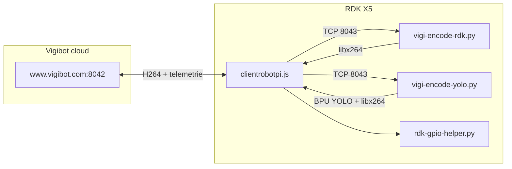

# Vigibot sur RDK X5

Intégration d'un robot **D-Robotics RDK X5** avec la stack **[Vigibot](https://www.vigibot.com)** (`clientrobotpi.js`), initialement conçue pour Raspberry Pi.

Ce dépôt versionne les scripts adaptés, la configuration exemple, les unités systemd et la documentation POC. Le SDK Hobot (caméra, BPU) reste dans un dépôt séparé : [x5-hobot-spdev](https://github.com/D-Robotics/x5-hobot-spdev).

## État du POC

| Volet | État | Solution retenue |
|-------|------|------------------|
| Vidéo source 0 (H.264) | OK | libx264 software (ffmpeg) |
| Vidéo source 1 (YOLO) | OK | Pipeline Python + BPU, stream-first |
| Moteurs DC | OK | Soft PWM 250 Hz + deadzone ±15 |
| Buzzer | OK | Soft PWM via bridge GPIO |
| Servos | Dégradé | Soft PWM 50 Hz — tremblement au repos |
| Encodeur H.264 matériel | Abandonné | Incompatible décodeur navigateur Vigibot |
| PCA9685 | Non disponible | Pas de module sur le robot de test |

Fil conducteur : Vigibot suppose `pigpio`, encodeur caméra Pi et soft PWM universel. Sur RDK X5, chaque primitive a été remplacée ou contournée — voir [docs/poc-vigibot-rdk-x5.md](docs/poc-vigibot-rdk-x5.md).

## Architecture



L'encodeur vidéo est un **process externe** lancé via `CMDDIFFUSION` (`sys.json`). Il pousse du H.264 Annex-B sur `tcp://127.0.0.1:8043`, relu par Node et retransmis au serveur Vigibot.

## Prérequis

| Composant | Détail |
|-----------|--------|
| Carte | RDK X5, Ubuntu 22.04, kernel 6.1.x |
| Caméra | IMX219 (CSI) |
| Client Vigibot | `clientrobotpi.js` installé dans `/usr/local/vigiclient/` |
| Runtime | Node.js, Python 3, ffmpeg, `Hobot.GPIO`, `hobot_dnn`, `hobot_vio` |
| Modèle YOLO | `/opt/hobot/model/x5/basic/yolov5s_v7_640x640_nv12.bin` |

## Installation rapide

### 1. Cloner sur la carte (ou PC de dev)

```bash
git clone <URL-de-votre-repo>/vigibot-rdk-x5.git
cd vigibot-rdk-x5
```

### 2. (Optionnel) Rapatrier depuis une carte de référence

Depuis un PC avec accès SSH à la carte POC :

```bash
export BOARD_HOST=10.146.245.115   # adapter l'IP
chmod +x scripts/fetch-from-board.sh
./scripts/fetch-from-board.sh
```

Récupère les fichiers modifiés de `/usr/local/vigiclient/` et les unités systemd. **Ne committez jamais** `robot.json` avec de vrais identifiants.

### 3. Déployer sur la RDK

Sur la carte, en root :

```bash
cd vigibot-rdk-x5
chmod +x install/install.sh scripts/health-check.sh
sudo ./install/install.sh
```

L'installateur :

- sauvegarde `/usr/local/vigiclient/` existant ;
- copie les scripts RDK (`vigi-encode-*`, `rdk-*`) ;
- installe systemd + drop-in `encode.conf` (`VIGI_USE_FFMPEG=1`) ;
- active et redémarre `vigiclient`.

### 4. Configuration

```bash
sudo cp config/robot.json.example /usr/local/vigiclient/robot.json
sudo nano /usr/local/vigiclient/robot.json   # NAME, PASSWORD Vigibot
```

`sys.json` est créé depuis l'exemple si absent. La config hardware officielle Vigibot Pi (numéros **BCM**) est conservée ; la traduction BCM→BOARD se fait dans `rdk-gpio-helper.py`.

## Exploitation

```bash
sudo systemctl enable vigiclient
sudo systemctl start vigiclient
sudo systemctl status vigiclient
tail -f /var/log/vigiclient.log
sudo ./scripts/health-check.sh
```

### Changement de source vidéo (0 ↔ 1)

Si écran noir ou `Mipi csi0 has been used` :

```bash
kill -9 $(pgrep -f 'vigi-encode-yolo|vigi-encode-rdk') 2>/dev/null
sleep 2
sudo systemctl restart vigiclient
```

Runbook complet : [docs/known-issues.md](docs/known-issues.md).

## Structure du dépôt

```
├── README.md
├── docs/                 # Documentation POC détaillée
├── vigiclient/           # Scripts déployés sur la carte
├── config/               # Exemples sys.json, robot.json
├── systemd/              # vigiclient.service + drop-ins
├── install/install.sh    # Déploiement idempotent
└── scripts/
    ├── fetch-from-board.sh
    └── health-check.sh
```

## Documentation

| Document | Contenu |
|----------|---------|
| [docs/README.md](docs/README.md) | Index |
| [docs/poc-vigibot-rdk-x5.md](docs/poc-vigibot-rdk-x5.md) | Rapport POC, tableau des 12 configs |
| [docs/video-encoding.md](docs/video-encoding.md) | H.264 SW vs HW Wave521 |
| [docs/yolo-source.md](docs/yolo-source.md) | 2ᵉ source YOLO BPU |
| [docs/gpio-mapping.md](docs/gpio-mapping.md) | Bridge GPIO, BCM→BOARD, PWM HW |
| [docs/known-issues.md](docs/known-issues.md) | Runbook opérationnel |

## Roadmap

1. **Servos** — migrer vers PWM hardware X5 (`srpi-config`, `GPIO.PWM(50)`)
2. **Failsafe latence** — ré-implémenter proprement (garde `boucleVideoCommande`)
3. **Switch CSI** — cleanup encodeur garanti au changement de source
4. **PCA9685** — implémenter `rdk-i2c-bus.js` / `rdk-pca9685.js` si module ajouté
5. **CI déploiement** — scp/rsync depuis GitHub Actions ou tag release

## Licence

MIT — voir [LICENSE](LICENSE). Le client Vigibot (`clientrobotpi.js`) reste soumis aux conditions Vigibot.
