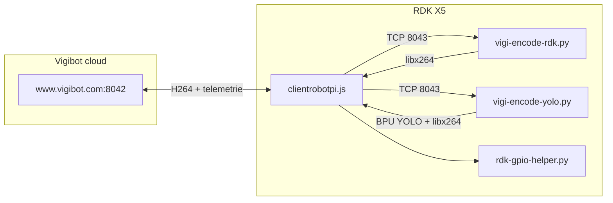

# Rapport POC — Intégration Vigibot sur RDK X5

## 1. Résumé exécutif

Le POC visait à faire fonctionner un robot **RDK X5** avec la stack **Vigibot** (`clientrobotpi.js`), initialement conçue pour Raspberry Pi. Quatre volets ont été traités :

| Volet | État final | Nature de la solution |
|-------|-----------|------------------------|
| Encodage vidéo H.264 | Fonctionnel | Contournement logiciel (libx264) |
| 2ᵉ source vidéo + overlay YOLO | Fonctionnel | Pipeline Python + BPU |
| Alarme de latence (faux positifs) | Contourné | Patch / neutralisation |
| GPIO (moteurs, buzzer, servos) | Partiel | Bridge Python + soft PWM |

**Fil conducteur** : Vigibot suppose des primitives Raspberry Pi (`pigpio`, encodeur caméra V4L2/HW, soft PWM universel) qui n'existent pas ou diffèrent sur RDK X5. Chaque volet a nécessité une adaptation de la couche basse, avec des compromis documentés dans les guides détaillés.

---

## 2. Contexte matériel et logiciel

### 2.1 Plateforme

- **Carte** : RDK X5, caméra CSI **IMX219** (mipi rx csi0)
- **OS** : Ubuntu 22.04.5 LTS, kernel 6.1.83
- **Runtime IA** : BPU (Bayes-e), `hobot_dnn.pyeasy_dnn` OK, `libpostprocess.so` disponible
- **Modèles précompilés** : `/opt/hobot/model/x5/basic/*.bin` (yolov5s_v7, yolov8, yolov10, etc.)

### 2.2 Stack Vigibot

Les modules `rdk-*.js` fournis avec le client Vigibot RDK étaient des **stubs vides** (no-op) : aucune action matérielle réelle n'était câblée au départ. Le POC a consisté à les remplacer ou compléter (GPIO bridge) tout en conservant la config hardware officielle Vigibot (numéros BCM Raspberry Pi).

---

## 3. Architecture logicielle globale

**Point clé** : l'encodeur vidéo n'est **pas** dans Node. C'est un process externe lancé via `CMDDIFFUSION` (défini dans `sys.json`) qui pousse un flux H.264 Annex-B sur `tcp://127.0.0.1:8043`, relu par Node et retransmis au serveur Vigibot.

### Composants clés

| Fichier | Rôle |
|---------|------|
| `clientrobotpi.js` | Client principal Vigibot (télécommande, GPIO, vidéo) |
| `sys.json` | Ports, `CMDDIFFUSION`, adresses I2C, fréquence PCA |
| `vigi-encode-rdk.py` | Encodeur source 0 (caméra brute) |
| `vigi-encode-yolo.py` | Encodeur source 1 (overlay YOLO) |
| `rdk-pigpio.js` | API pigpio-like → spawn `rdk-gpio-helper.py` |
| `rdk-gpio-helper.py` | Daemon Hobot.GPIO (BCM→BOARD, soft PWM, soft servo) |

---

## 4. Tableau récapitulatif des configurations

| # | Volet | Configuration essayée | Résultat | Cause racine de l'échec | Contournement | Conséquence |
|---|-------|----------------------|----------|-------------------------|---------------|-------------|
| 1 | Vidéo | HW encoder natif `hb_mm_mc` Baseline | Échec (gris/noir) | Slices Wave521 non Broadway-compatibles | — | — |
| 2 | Vidéo | Patch SPS constrained baseline | Échec | Problème dans les slices, pas le SPS | — | — |
| 3 | Vidéo | ffmpeg `dump_extra` rewrap | Échec | Rewrap ne réencode pas | — | — |
| 4 | Vidéo | **SW libx264** | **OK** | — | Encodage CPU ffmpeg | 15 fps, latence 200–600 ms |
| 5 | YOLO | Load modèle avant flux | Échec (noir) | Blocage 1ʳᵉ inférence | Stream-first + infer 1/N | Boîtes retardées |
| 6 | YOLO | Switch source 0↔1 | Échec intermittent | CSI non libérée | kill PID + délai | Switch fragile |
| 7 | Latence | Logique d'origine | Faux positif | `Date.now()-0` | Garde + neutralisation | Sécurité affaiblie |
| 8 | GPIO | Stubs no-op | Rien ne bouge | Non implémenté | Bridge Python | 1 process dédié |
| 9 | Moteurs | `pwmWrite` stub | Rien | Non implémenté | Soft PWM 250 Hz + deadzone ±15 | Jitter, CPU ~17 % |
| 10 | Servos | Soft PWM 50 Hz | Dégradé | userspace non temps-réel | busy-wait, 1 thread, hystérésis | Tremblement au repos |
| 11 | Servos | PCA9685 | Impossible | Pas de module physique | — | — |
| 12 | Servos | PWM HW X5 | **À faire** | Hypothèse X3 erronée levée | `srpi-config` + `GPIO.PWM(50)` | Mux à gérer |

---

## 5. Synthèse par volet

### Vidéo

L'encodeur matériel Wave521 produit un flux Baseline dont le **contenu des slices** n'est pas décodable par le lecteur Vigibot (navigateur). La solution retenue est un pipeline **NV12 → libx264 → TCP 8043** à 15 fps et ~700 kbps. Voir [video-encoding.md](./video-encoding.md).

### YOLO (source 1)

Deuxième entrée `CMDDIFFUSION` + caméra `"SOURCE": 1`. Pipeline BPU avec overlay OpenCV. Stratégie **stream-first** obligatoire pour éviter l'écran noir au démarrage. Voir [yolo-source.md](./yolo-source.md).

### GPIO

Bridge Node → Python → Hobot.GPIO avec traduction BCM→BOARD. Moteurs et buzzer OK en soft PWM. Servos insuffisants sans PWM hardware ou PCA9685. Voir [gpio-mapping.md](./gpio-mapping.md).

### Opérations

Runbook diagnostic, fausses alarmes latence, déploiement SSH. Voir [known-issues.md](./known-issues.md).

---

## 6. Recommandations d'amélioration

### Vidéo

- Investiguer compatibilité slices Wave521 vs décodeurs navigateur (WebCodecs)
- Documenter matrice profil H.264 / Broadway
- Tester montée FPS (20–25) si CPU le permet

### YOLO

- Pipeline multi-thread (capture / inférence / encode)
- Aligner versions OpenExplorer (modèle vs HBRT)
- Versionner scripts, déploiement par git/scp (plus de heredocs SSH)

### GPIO

- **Servos** : migrer vers PWM hardware X5 (8 canaux, 50 Hz via `srpi-config`)
- **Moteurs** : envisager PWM HW sur broches dédiées
- Ré-implémenter sécurité latence proprement (au lieu de neutralisation)
- Valider IR illuminators et switches

### Industrialisation

- Versionner tous les fichiers `/usr/local/vigiclient/` modifiés dans un dépôt dédié
- Script d'installation idempotent (backup + copie + `py_compile` + restart)
- Runbook opérationnel maintenu à jour

---

## 7. Références

- [video-encoding.md](./video-encoding.md)
- [yolo-source.md](./yolo-source.md)
- [gpio-mapping.md](./gpio-mapping.md)
- [known-issues.md](./known-issues.md)
- Doc D-Robotics RDK X5 — [PWM 40-pin](https://developer.d-robotics.cc/rdk_x_doc/en/Basic_Application/01_40pin_user_sample/pwm)
- Doc D-Robotics RDK X5 — [Pin definition](https://developer.d-robotics.cc/rdk_x_doc/en/Basic_Application/01_40pin_user_sample/40pin_define)
