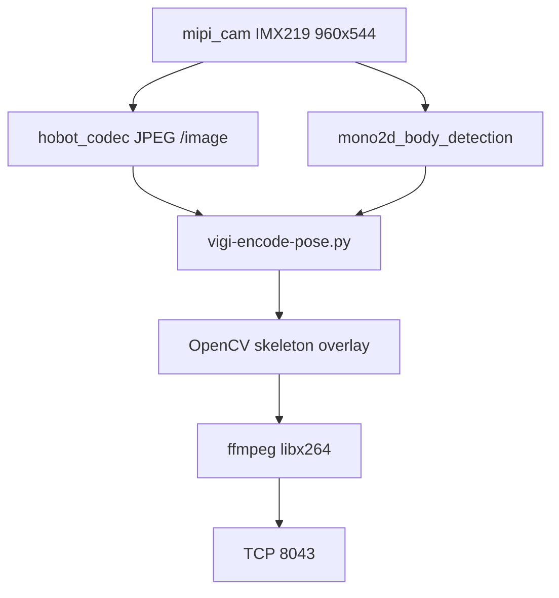

# Video Source 2 — Body Keypoint Tracking (TROS)

## 1. Objective

Add a **third Vigibot camera source** that streams the IMX219 feed with a
**human body skeleton overlay**, using the precompiled TROS mono2d body
detection model shipped on the RDK X5.

## 2. Vigibot Integration

### System Configuration (`sys.json`)

Three entries in `CMDDIFFUSION`:

```json
"CMDDIFFUSION": [
  [ "/usr/local/vigiclient/vigi-encode-rdk.sh ", "WIDTH ", "HEIGHT ", "FPS ", "BITRATE" ],
  [ "/usr/local/vigiclient/vigi-encode-yolo.sh ", "WIDTH ", "HEIGHT ", "FPS ", "BITRATE" ],
  [ "/usr/local/vigiclient/vigi-encode-pose.sh ", "WIDTH ", "HEIGHT ", "FPS ", "BITRATE" ]
]
```

| Index | Script | Vigibot Usage |
|-------|--------|---------------|
| 0 | `vigi-encode-rdk.sh` | Raw camera (`SOURCE: 0`) |
| 1 | `vigi-encode-yolo.sh` | Camera + YOLO (`SOURCE: 1`) |
| 2 | `vigi-encode-pose.sh` | Camera + body keypoints (`SOURCE: 2`) |

### Hardware Configuration

Add a third camera in the Vigibot robot configuration (cloud UI or `robot.json`
pushed by the server):

```json
{
  "TYPE": "",
  "SOURCE": 2,
  "WIDTH": 640,
  "HEIGHT": 480,
  "FPS": 15,
  "BITRATE": 900000
}
```

`SOURCE: 2` must match the third `CMDDIFFUSION` entry.

### CSI Constraint

There is still only one physical CSI camera. Sources 0, 1, and 2 are mutually
exclusive. Vigibot stops the previous encoder when switching.

## 3. Software Architecture



### Components

| Stage | Technology |
|-------|-------------|
| Capture / JPEG | TROS `mipi_cam` + `hobot_codec` |
| Pose model | `multitask_body_head_face_hand_kps_960x544.hbm` |
| Detection node | `mono2d_body_detection` (`/hobot_mono2d_body_detection`) |
| Overlay | OpenCV lines/circles for COCO-17 body keypoints |
| Encoding | Same libx264 Baseline pipeline as the other sources |
| Output | TCP 8043 → Node |

### Model Used

```text
/opt/tros/humble/lib/mono2d_body_detection/config/multitask_body_head_face_hand_kps_960x544.hbm
```

This is the official precompiled body / head / face / hand keypoint model from
the TROS Humble package on the board.

## 4. Files

| File | Role |
|------|------|
| `vigi-encode-pose.sh` | Sources `/opt/tros/humble/setup.bash`, launches Python |
| `vigi-encode-pose.py` | Subscribes to JPEG + keypoints, draws, encodes |
| `vigi-pose.launch.py` | Minimal TROS launch: camera, JPEG codec, detector |

## 5. Operations

```bash
# Ensure source 2 is wired
python3 -c 'import json; print(json.load(open("/usr/local/vigiclient/sys.json"))["CMDDIFFUSION"])'

# Watch pose encoder logs after selecting the third camera in Vigibot
sudo journalctl -u vigiclient -f | grep --line-buffered -i pose

# Manual cleanup if CSI stays busy after a failed switch
kill -9 $(pgrep -f 'vigi-encode-pose|mono2d_body_detection|mipi_cam') 2>/dev/null
sudo systemctl restart vigiclient
```

Expected stderr lines once the third source is selected:

```text
starting TROS body-keypoint pipeline
pose source ready 640x480@15 bitrate=900000
sent 30 pose frames (people=1)
```

## 6. Known Limitations

- Heavier than YOLO: the TROS graph owns the camera at 960×544.
- Recommended bitrate/FPS: about 15 fps and ≤900 kbps.
- Residual CSI switching fragility remains the same as for YOLO.
- The Vigibot cloud camera list must include `SOURCE: 2`; board-side
  `CMDDIFFUSION` alone is not enough.
