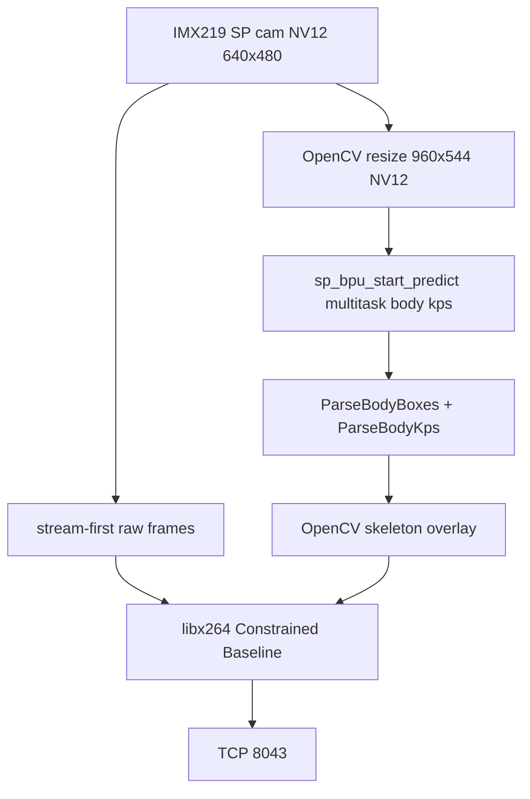

# Video Source 2 — Body Keypoint Tracking (C++)

## 1. Objective

Add a **third Vigibot camera source** that streams the IMX219 feed with a
**human body skeleton overlay**, using the official multitask body keypoint
model on the RDK X5 BPU — same full C++ path as sources 0 and 1 (no TROS/ROS).

## 2. Vigibot Integration

### System Configuration (`sys.json`)

Three entries in `CMDDIFFUSION`:

```json
"CMDDIFFUSION": [
  [ "/usr/local/vigiclient/vigi-encode-rdk.sh ", "WIDTH ", "HEIGHT ", "FPS ", "BITRATE" ],
  [ "/usr/local/vigiclient/vigi-encode-yolo.sh ", "WIDTH ", "HEIGHT ", "FPS ", "BITRATE" ],
  [ "/usr/local/vigiclient/vigi-encode-pose.sh ", "WIDTH ", "HEIGHT ", "FPS ", "BITRATE" ]
]
```

| Index | Script | Vigibot Usage |
|-------|--------|---------------|
| 0 | `vigi-encode-rdk.sh` | Raw camera (`SOURCE: 0`) |
| 1 | `vigi-encode-yolo.sh` | Camera + YOLO (`SOURCE: 1`) |
| 2 | `vigi-encode-pose.sh` | Camera + body keypoints (`SOURCE: 2`) |

### Hardware Configuration

Add a third camera in the Vigibot robot configuration (cloud UI or `robot.json`
pushed by the server):

```json
{
  "TYPE": "",
  "SOURCE": 2,
  "WIDTH": 640,
  "HEIGHT": 480,
  "FPS": 15,
  "BITRATE": 900000
}
```

`SOURCE: 2` must match the third `CMDDIFFUSION` entry.

### CSI Constraint

There is still only one physical CSI camera. Sources 0, 1, and 2 are mutually
exclusive. Vigibot stops the previous encoder when switching.

## 3. Software Architecture



### Components

| Stage | Technology |
|-------|-------------|
| Capture | `sp_open_camera_v2` / `sp_vio_get_frame` (same as sources 0/1) |
| Inference | `sp_init_bpu_module` + `sp_bpu_start_predict` on `.hbm` |
| Post-processing | `pose_post_process.cpp` (body boxes + COCO-17 keypoints) |
| Overlay | OpenCV lines/circles for body skeleton |
| Encoding | same libx264 C++ path as sources 0/1 |
| Binary | `/usr/local/vigiclient/vigi-encode-pose` (TROS Python fallback in `.sh`) |

### Model Used

```text
/opt/tros/humble/lib/mono2d_body_detection/config/multitask_body_head_face_hand_kps_960x544.hbm
```

Input **960×544**, 9 outputs; body boxes index **1**, keypoints index **8**.
Loaded directly via `libdnn` / `spcdev` — no ROS nodes.

## 4. Files

| File | Role |
|------|------|
| `vigi-encode-pose.cpp` | Full C++ pipeline: cam → BPU → draw → libx264 → `:8043` |
| `pose_post_process.{hpp,cpp}` | Body box + keypoint parsers (no ROS) |
| `vigi-encode-pose.sh` | Prefers C++ binary; falls back to TROS + Python |
| `rebuild-pose-cpp-on-board.sh` | Copy sources + `g++` link on the board |
| `vigi-encode-pose.py` / `vigi-pose.launch.py` | Legacy TROS fallback only |

## 5. Operations

```bash
# Ensure source 2 is wired
python3 -c 'import json; print(json.load(open("/usr/local/vigiclient/sys.json"))["CMDDIFFUSION"])'

# Rebuild on board (after scp of sources to /tmp)
bash /tmp/rebuild-pose-cpp-on-board.sh

# Standalone smoke test (stop vigiclient first — CSI exclusive)
sudo systemctl stop vigiclient
nc -l -p 8043 > /tmp/pose.264 &
/usr/local/vigiclient/vigi-encode-pose 640 480 8 100000
sudo systemctl start vigiclient

# Watch logs after selecting SOURCE 2 in Vigibot
sudo journalctl -u vigiclient -f | grep --line-buffered -i pose
```

Expected stderr once the third source is selected:

```text
pose overlay armed
sent 30 pose frames (people=1)
```

## 6. Known Limitations

- Model runs at 960×544 internally; display/encode stays 640×480.
- Recommended bitrate/FPS: about 8–15 fps and ≤900 kbps (uplink clamps apply).
- Residual CSI switching fragility remains the same as for YOLO.
- The Vigibot cloud camera list must include `SOURCE: 2`; board-side
  `CMDDIFFUSION` alone is not enough.
- If keypoints look shifted, check `aligned_kps_dim` / tensor props after
  `sp_init_bpu_tensors`.
