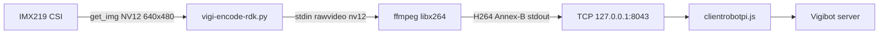

# Encodage vidéo H.264 — Vigibot / RDK X5

## 1. Contrainte Vigibot

Le lecteur Vigibot (navigateur, décodeur type Broadway / WebCodecs) exige un flux :

- **H.264 Baseline / Constrained Baseline**
- En-têtes **SPS/PPS répétés** (`repeat-headers=1`) pour reprise en cours de flux
- Format **Annex-B** (start codes)
- Compatible décodage navigateur (Chrome, Firefox)

## 2. Architecture retenue (logicielle)

### Pipeline détaillé

1. `libsrcampy.Camera.open_cam(0, -1, fps, 640, 480)`
2. `get_img(2, 640, 480)` → buffer NV12 (460 800 octets)
3. Écriture NV12 brut sur **stdin** de ffmpeg
4. ffmpeg encode en **libx264** Baseline level 3.1
5. Thread reader envoie stdout H.264 vers **socket TCP** connecté à Node (port 8043)

### Paramètres finaux

| Paramètre | Valeur |
|-----------|--------|
| Résolution | 640×480 (native, indépendamment de la requête Vigibot) |
| FPS | 15 (plafonné, config demande 30) |
| Bitrate | ~700 kbps (plafonné 300k–700k) |
| Profil | baseline, level 3.1 |
| Preset | ultrafast, tune zerolatency |
| x264-params | `repeat-headers=1:annexb=1:sliced-threads=0` |

### Activation

- Variable `VIGI_USE_FFMPEG=1` (drop-in systemd `/etc/systemd/system/vigiclient.service.d/encode.conf`)
- Fichiers : `/usr/local/vigiclient/vigi-encode-rdk.py`, `vigi-encode-rdk.sh`

### Handshake TCP

Node **écoute** sur le port 8043. L'encodeur Python fait `connect()` vers `127.0.0.1:8043` et pousse le flux via un thread reader (`read(65536)` → `sendall`).

---

## 3. Configurations essayées et échecs

### A — Encodeur matériel natif (Wave521 via `hb_mm_mc_*`)

| | |
|--|--|
| **Description** | Binaire C++ (`src/vigi_encode_rdk.cpp`) : capture `sp_open_camera_v2` / `sp_vio_get_frame`, encode natif Baseline + CBR (`vbv_buffer_size`, etc.), IDR via `request_idr_header` / `request_idr_frame`. Liens `-lspcdev -lhbspdev -lmultimedia -lhbmem`. |
| **Motivation** | Décharger le CPU, latence basse, exploitation VPU. |
| **Résultat** | Image **grise/noire** dans Vigibot. |
| **Analyse offline SPS** | HW : `profile_idc=66` mais `constraint_set0=0`, `constraint_set1=0`, level 30. SW (référence) : `cs0=1`, `cs1=1`, level 31 (Constrained Baseline). |
| **Cause racine** | `libspdev`/`hobot_vio` impose le profil H.264. Le **contenu des slices** Wave521 n'est pas digeste par le décodeur navigateur, au-delà du flag SPS. |

### B — Patch SPS « Constrained Baseline »

| | |
|--|--|
| **Description** | Réécriture SPS en C++ (`patch_sps_constrained`) : forcer `cs0/cs1=1` + level 31. |
| **Résultat** | Dump offline **conforme au SW**, mais **toujours gris/noir** en live. |
| **Cause racine** | Le problème n'est **pas** dans l'en-tête SPS mais dans les **NAL de données** (slices). Patcher le SPS ne change pas l'encodage réel. |

### C — Rewrap via ffmpeg (`-bsf dump_extra`)

| | |
|--|--|
| **Description** | HW encoder → tcp:18043 → ffmpeg `dump_extra` → tcp:8043. |
| **Résultat** | Pas d'amélioration. |
| **Cause racine** | Un bitstream filter **ne réencode pas** les slices. |

### D — Post-traitement ffmpeg `h264_metadata=profile=baseline` (copy)

Testé en amont du POC : modification du SPS en `-c:v copy` sans réencodage → même classe de problème que B.

---

## 4. Conséquences du contournement SW

| Aspect | Conséquence |
|--------|-------------|
| **CPU** | Charge x264 permanente (~12 %/core) |
| **FPS** | Plafonné à 15 au lieu de 30 demandés → image « molle » |
| **Latence** | 200–600 ms typique (variable selon charge CPU) |
| **Bitrate** | Bridé ~700 kbps pour tenir le CPU |
| **VPU** | Encodeur matériel Wave521 **inutilisé** en live Vigibot |
| **Robustesse** | Stable sur Firefox et Chrome après réglages |

---

## 5. Pièges et bonnes pratiques

| Piège | Solution |
|-------|----------|
| Logs Hobot mélangés sur **stdout** avec le flux H.264 | Isoler stdout binaire ; logs sur stderr uniquement |
| Recompilation / remplacement de `libhbspdev` | **Garder les libs caméra stock** — rebuild a cassé la caméra |
| `grep VIDEO NAL` sans guillemets | Utiliser `grep 'VIDEO NAL'` — le shell interprète mal |
| Logs encodeur dans `/var/log/vigiclient.log` | `VIDEO NAL` part sur **journald** (`console.error` Node) |
| Chrome parfois noir au début | Firefox plus fiable ; SW OK sur les deux après stabilisation |
| `EADDRINUSE` port 8043 | Ancien encodeur non tué → kill process + restart |

---

## 6. Fichiers de référence

| Chemin | Rôle |
|--------|------|
| `/usr/local/vigiclient/vigi-encode-rdk.py` | Encodeur SW actif |
| `/usr/local/vigiclient/vigi-encode-rdk.sh` | Wrapper shell |
| `/usr/local/vigiclient/vigi-encode-rdk.py.sw` | Backup stable |
| `/usr/local/vigiclient/src/vigi_encode_rdk.cpp` | Expérimental HW (abandonné live) |
| `/usr/local/vigiclient/sys.json` | `CMDDIFFUSION`, `VIDEOLOCALPORT: 8043` |

---

## 7. Piste d'amélioration future

- Comparer dumps de slices HW vs SW au niveau NAL (type, structure, reference frames)
- Tester profils/presets VPU alternatifs via `sample_codec` offline
- Envisager décodeur côté client (WebCodecs) plutôt que contraindre le bitstream Broadway
- Monter progressivement FPS/bitrate en mesurant CPU et latence de bout en bout
