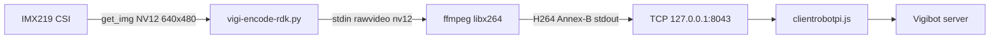

# H.264 Video Encoding — Vigibot / RDK X5

## 1. Vigibot Constraint

The Vigibot player (browser, Broadway-style decoder / WebCodecs) requires a stream with:

- **H.264 Baseline / Constrained Baseline**
- **Repeated SPS/PPS headers** (`repeat-headers=1`) to allow playback to start mid-stream
- **Annex-B** format (start codes)
- Browser-compatible decoding (Chrome, Firefox)

## 2. Selected Architecture (Software)

### Detailed Pipeline

1. `libsrcampy.Camera.open_cam(0, -1, fps, 640, 480)`
2. `get_img(2, 640, 480)` → NV12 buffer (460,800 bytes)
3. Write raw NV12 to ffmpeg **stdin**
4. ffmpeg encodes with **libx264** Baseline level 3.1
5. A reader thread sends H.264 stdout to the **TCP socket** connected to Node (port 8043)

### Final Parameters

| Parameter | Value |
|-----------|--------|
| Resolution | 640×480 (native, regardless of the Vigibot request) |
| FPS | 15 (capped; configuration may request 30) |
| Bitrate | ~700 kbps (capped to 300k–700k) |
| Profile | baseline, level 3.1 |
| Preset | ultrafast, tune zerolatency |
| x264-params | `repeat-headers=1:annexb=1:sliced-threads=0` |

### Activation

- `VIGI_USE_FFMPEG=1` variable (systemd drop-in `/etc/systemd/system/vigiclient.service.d/encode.conf`)
- Files: `/usr/local/vigiclient/vigi-encode-rdk.py`, `vigi-encode-rdk.sh`

### Handshake TCP

Node **listens** on port 8043. The Python encoder calls `connect()` to `127.0.0.1:8043` and pushes the stream through a reader thread (`read(65536)` → `sendall`).

---

## 3. Attempted Configurations and Failures

### A — Native Hardware Encoder (Wave521 via `hb_mm_mc_*`)

| | |
|--|--|
| **Description** | C++ binary (`src/vigi_encode_rdk.cpp`): `sp_open_camera_v2` / `sp_vio_get_frame` capture, native Baseline + CBR encoding (`vbv_buffer_size`, etc.), IDR through `request_idr_header` / `request_idr_frame`. Links against `-lspcdev -lhbspdev -lmultimedia -lhbmem`. |
| **Motivation** | Offload the CPU, reduce latency, and use the VPU. |
| **Result** | **Gray/black** image in Vigibot. |
| **Offline SPS analysis** | HW: `profile_idc=66`, but `constraint_set0=0`, `constraint_set1=0`, level 30. SW (reference): `cs0=1`, `cs1=1`, level 31 (Constrained Baseline). |
| **Root cause** | `libspdev`/`hobot_vio` imposes the H.264 profile. Beyond the SPS flag, the browser decoder cannot handle the Wave521 **slice content**. |

### B — "Constrained Baseline" SPS Patch

| | |
|--|--|
| **Description** | SPS rewrite in C++ (`patch_sps_constrained`): force `cs0/cs1=1` + level 31. |
| **Result** | Offline dump **matches the SW output**, but the live image is **still gray/black**. |
| **Root cause** | The problem is **not** in the SPS header, but in the **data NAL units** (slices). Patching the SPS does not change the actual encoding. |

### C — Rewrap via ffmpeg (`-bsf dump_extra`)

| | |
|--|--|
| **Description** | HW encoder → tcp:18043 → ffmpeg `dump_extra` → tcp:8043. |
| **Result** | No improvement. |
| **Root cause** | A bitstream filter **does not re-encode** slices. |

### D — ffmpeg `h264_metadata=profile=baseline` Post-processing (Copy)

Tested before the POC: modifying the SPS with `-c:v copy` without re-encoding → same class of problem as B.

---

## 4. Consequences of the Software Workaround

| Aspect | Consequence |
|--------|-------------|
| **CPU** | Continuous x264 load (~12%/core) |
| **FPS** | Capped at 15 instead of the requested 30 → less responsive video |
| **Latency** | Typically 200–600 ms (varies with CPU load) |
| **Bitrate** | Limited to ~700 kbps to keep CPU usage manageable |
| **VPU** | Wave521 hardware encoder **unused** for live Vigibot video |
| **Robustness** | Stable on Firefox and Chrome after tuning |

---

## 5. Pitfalls and Best Practices

| Pitfall | Solution |
|-------|----------|
| Hobot logs mixed with the H.264 stream on **stdout** | Isolate binary stdout; send logs to stderr only |
| Rebuilding / replacing `libhbspdev` | **Keep the stock camera libraries** — rebuilding broke the camera |
| Unquoted `grep VIDEO NAL` | Use `grep 'VIDEO NAL'` — the shell otherwise parses it incorrectly |
| Looking for encoder logs in `/var/log/vigiclient.log` | `VIDEO NAL` is sent to **journald** (Node `console.error`) |
| Chrome sometimes shows black video initially | Firefox is more reliable; SW works on both after stabilization |
| `EADDRINUSE` on port 8043 | Previous encoder was not terminated → kill process + restart |

---

## 6. Reference Files

| Path | Role |
|--------|------|
| `/usr/local/vigiclient/vigi-encode-rdk.py` | Active SW encoder |
| `/usr/local/vigiclient/vigi-encode-rdk.sh` | Shell wrapper |
| `/usr/local/vigiclient/vigi-encode-rdk.py.sw` | Stable backup |
| `/usr/local/vigiclient/src/vigi_encode_rdk.cpp` | Experimental HW implementation (abandoned for live use) |
| `/usr/local/vigiclient/sys.json` | `CMDDIFFUSION`, `VIDEOLOCALPORT: 8043` |

---

## 7. Future Improvements

- Compare HW and SW slice dumps at the NAL level (type, structure, reference frames)
- Test alternative VPU profiles/presets offline with `sample_codec`
- Consider a client-side decoder (WebCodecs) instead of constraining the bitstream for Broadway
- Gradually increase FPS/bitrate while measuring CPU usage and end-to-end latency
