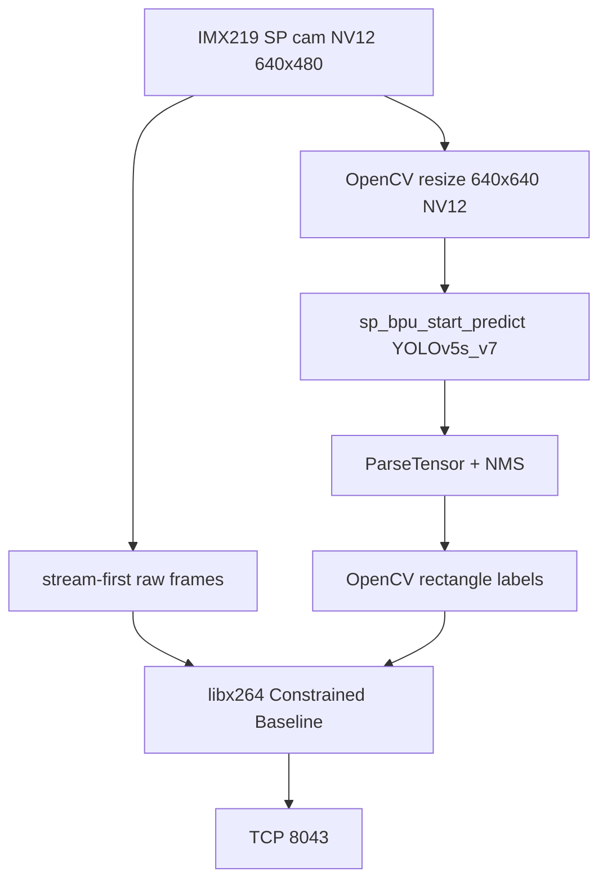

# Video Source 1 — YOLO Overlay (BPU)

## 1. Objective

Add a **second camera source** to Vigibot that streams the IMX219 feed with **YOLO object detection** drawn as an overlay, reusing the precompiled models on the RDK X5 board.

## 2. Vigibot Integration

### System Configuration (`sys.json`)

Two entries in `CMDDIFFUSION`:

```json
"CMDDIFFUSION": [
  [ "/usr/local/vigiclient/vigi-encode-rdk.sh ", "WIDTH ", "HEIGHT ", "FPS ", "BITRATE" ],
  [ "/usr/local/vigiclient/vigi-encode-yolo.sh ", "WIDTH ", "HEIGHT ", "FPS ", "BITRATE" ]
]
```

| Index | Script | Vigibot Usage |
|-------|--------|---------------|
| 0 | `vigi-encode-rdk.sh` | Raw camera (`SOURCE: 0`) |
| 1 | `vigi-encode-yolo.sh` | Camera + YOLO (`SOURCE: 1`) |
| 2 | `vigi-encode-pose.sh` | Camera + body keypoints (`SOURCE: 2`) |

**Important**: `"SOURCE": 1` corresponds to the **second `CMDDIFFUSION` entry** (index 1). `"SOURCE": 2` is the body-keypoint source documented in [pose-source.md](./pose-source.md).

### Hardware Configuration

Second camera in the robot configuration:

```json
{
  "TYPE": "",
  "SOURCE": 1,
  "WIDTH": 640,
  "HEIGHT": 480,
  "FPS": 30,
  "BITRATE": 1500000
}
```

### CSI Constraint

There is only one physical CSI camera: sources 0 and 1 are **mutually exclusive**. Vigibot stops the previous source when switching, which is acceptable behavior.

---

## 3. Software Architecture



### Components

| Stage | Technology |
|-------|-------------|
| Capture | `sp_open_camera_v2` / `sp_vio_get_frame` (same as source 0) |
| Inference | `sp_init_bpu_module` + `sp_bpu_start_predict` |
| Post-processing | vendored `yolov5_post_process.cpp` (ParseTensor + NMS) |
| Overlay | OpenCV `rectangle` / `putText` |
| Encoding | same libx264 C++ path as source 0 |
| Binary | `/usr/local/vigiclient/vigi-encode-yolo` (Python fallback in `.sh`) |

### Model Used

```
/opt/hobot/model/x5/basic/yolov5s_v7_640x640_nv12.bin
```

Validated reference sample:

```
/app/pydev_demo/12_yolov5s_v6_v7_sample/test_yolov5s_v7.py
```

Offline validation: person/kite detections work on `kite.jpg`. HBRT version 3.15.55 vs. model version 3.15.47 warning — tolerated.

### Post-processing Parameters

| Parameter | Value |
|-----------|--------|
| `score_threshold` | 0.4 |
| `nms_threshold` | 0.45 |
| `nms_top_k` | 20 |
| `is_pad_resize` | 0 |
| JSON offset | `result_str[16:]` (as in the official sample) |

---

## 4. Stream-first Strategy

### Problem: Black Screen at Startup

**Symptom**: the YOLO process starts, the model loads, and TCP 8043 connects, but **no frames** are sent (`sent … yolo frames` is absent from the logs).

**Root cause**: the **first BPU inference** or model loading blocks **before** any data is sent → the Vigibot player receives nothing.

### Selected Solution

1. **Passthrough**: send the first 30 **raw** NV12 frames (without YOLO)
2. Establish the **TCP connection** and start ffmpeg **before** loading the model
3. **Load the model** after the stream has started
4. Enable the YOLO overlay with `INFER_EVERY = 2 or 3` (infer one frame out of every N)
5. **Safety fallback**: if an exception occurs in the YOLO loop, send the raw frame

### Consequences

| Aspect | Impact |
|--------|--------|
| Startup | ~2 s without boxes, then the overlay appears |
| Detection | Positions update every N frames, with slight lag on fast-moving objects |
| CPU | Two NV12↔BGR conversions per frame in overlay mode |
| Robustness | Better recovery after inference errors |

---

## 5. CSI Issue When Switching Sources

### Symptom

```
Mipi csi0 has been used
No camera sensor found
camera.open_cam failed
```

### Cause

The previous encoder (`vigi-encode-rdk.py` or `vigi-encode-yolo.py`) did not release the CSI interface before the new Diffusion process started.

### Workaround

```bash
kill -9 $(pgrep -f vigi-encode) 2>/dev/null
sleep 2
systemctl restart vigiclient
```

Wait 2–3 seconds after a failed switch before trying again.

### Consequence

The source-switching procedure is **fragile** and needs to be productionized (process supervision, guaranteed delay, cleanup signal handler).

---

## 6. Runtime Parameters

| Parameter | Value |
|-----------|--------|
| Capture resolution | 640×480 |
| Model resolution | 640×640 |
| FPS | 15 (capped) |
| Bitrate | ~700 kbps |
| `PASSTHROUGH_FRAMES` | 30 |
| `INFER_EVERY` | 2–3 |
| `WARMUP_ATTEMPTS` | 200 |

---

## 7. Files

| Path | Role |
|--------|------|
| `/usr/local/vigiclient/vigi-encode-yolo.py` | YOLO encoder (~416 lines) |
| `/usr/local/vigiclient/vigi-encode-yolo.sh` | Shell wrapper |
| `/usr/local/vigiclient/vigi-encode-yolo.py.rdkcopy` | Backup copy of the RDK encoder |

---

## 8. Future Improvements

- Multithreaded pipeline: separate capture / inference / encoding queues
- Align OpenExplorer versions (model compilation vs. HBRT runtime)
- Reduce NV12↔BGR conversions (direct NV12 overlay if possible)
- Versioned deployment (git/scp) instead of SSH heredocs
- Document the `result_str[16:]` offset and tensor structure in a model guide
