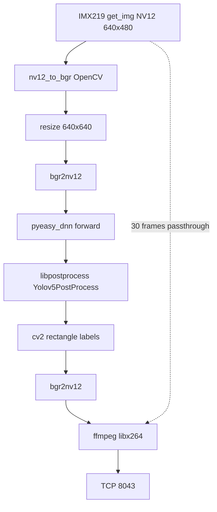

# Source vidéo 1 — Overlay YOLO (BPU)

## 1. Objectif

Ajouter dans Vigibot une **deuxième source de caméra** diffusant le flux IMX219 avec **détection d'objets YOLO** dessinée en overlay, en réutilisant les modèles précompilés sur la carte RDK X5.

## 2. Intégration Vigibot

### Configuration système (`sys.json`)

Deux entrées dans `CMDDIFFUSION` :

```json
"CMDDIFFUSION": [
  [ "/usr/local/vigiclient/vigi-encode-rdk.sh ", "WIDTH ", "HEIGHT ", "FPS ", "BITRATE" ],
  [ "/usr/local/vigiclient/vigi-encode-yolo.sh ", "WIDTH ", "HEIGHT ", "FPS ", "BITRATE" ]
]
```

| Index | Script | Usage Vigibot |
|-------|--------|---------------|
| 0 | `vigi-encode-rdk.sh` | Caméra brute (`SOURCE: 0`) |
| 1 | `vigi-encode-yolo.sh` | Caméra + YOLO (`SOURCE: 1`) |

**Important** : `"SOURCE": 1` correspond à la **2ᵉ entrée** `CMDDIFFUSION` (index 1). `"SOURCE": 2` imposerait une 3ᵉ entrée.

### Configuration hardware

Deuxième caméra dans la config robot :

```json
{
  "TYPE": "",
  "SOURCE": 1,
  "WIDTH": 640,
  "HEIGHT": 480,
  "FPS": 30,
  "BITRATE": 1500000
}
```

### Contrainte CSI

Une seule caméra CSI physique : les sources 0 et 1 sont **alternatives**. Vigibot coupe la source précédente au changement — comportement acceptable.

---

## 3. Architecture logicielle



### Composants

| Étape | Technologie |
|-------|-------------|
| Capture | `hobot_vio.libsrcampy.Camera`, `get_img(2, 640, 480)` |
| Inférence | `hobot_dnn.pyeasy_dnn`, modèle NV12 |
| Post-traitement | `libpostprocess.so` via ctypes (`Yolov5doProcess`, `Yolov5PostProcess`) |
| Overlay | OpenCV `rectangle`, `putText` |
| Encodage | Même pipeline libx264 que source 0 |
| Sortie | TCP 8043 → Node |

### Modèle utilisé

```
/opt/hobot/model/x5/basic/yolov5s_v7_640x640_nv12.bin
```

Sample de référence validé :

```
/app/pydev_demo/12_yolov5s_v6_v7_sample/test_yolov5s_v7.py
```

Validation offline : détections person/kite OK sur `kite.jpg`. Warning version HBRT 3.15.55 vs modèle 3.15.47 — toléré.

### Paramètres post-traitement

| Paramètre | Valeur |
|-----------|--------|
| `score_threshold` | 0.4 |
| `nms_threshold` | 0.45 |
| `nms_top_k` | 20 |
| `is_pad_resize` | 0 |
| Offset JSON | `result_str[16:]` (comme le sample officiel) |

---

## 4. Stratégie stream-first

### Problème : écran noir au démarrage

**Symptôme** : process YOLO lancé, modèle chargé, TCP 8043 connecté, mais **aucune frame** envoyée (`sent … yolo frames` absent dans les logs).

**Cause racine** : blocage sur la **1ʳᵉ inférence BPU** ou le chargement modèle **avant** tout envoi de données → le lecteur Vigibot ne reçoit rien.

### Solution retenue

1. **Passthrough** : envoyer les 30 premières frames NV12 **brutes** (sans YOLO)
2. **Connexion TCP** et démarrage ffmpeg **avant** chargement modèle
3. **Chargement modèle** après amorçage du flux
4. Bascule overlay YOLO avec `INFER_EVERY = 2 ou 3` (inférence 1 frame sur N)
5. **Filet de sécurité** : en cas d'exception dans la boucle YOLO, renvoyer la frame brute

### Conséquences

| Aspect | Impact |
|--------|--------|
| Démarrage | ~2 s sans boîtes, puis overlay |
| Détection | Positions rafraîchies tous les N frames, léger retard sur objets rapides |
| CPU | Double conversion NV12↔BGR par frame en mode overlay |
| Robustesse | Meilleure reprise après erreur inférence |

---

## 5. Problème CSI au switch de source

### Symptôme

```
Mipi csi0 has been used
No camera sensor found
camera.open_cam failed
```

### Cause

L'ancien encodeur (`vigi-encode-rdk.py` ou `vigi-encode-yolo.py`) n'a pas libéré la CSI avant le lancement du nouveau process Diffusion.

### Workaround

```bash
kill -9 $(pgrep -f vigi-encode) 2>/dev/null
sleep 2
systemctl restart vigiclient
```

Attendre 2–3 s après un switch raté avant de relancer.

### Conséquence

Procédure de changement de source **fragile** — à industrialiser (supervision process, délai garanti, cleanup signal handler).

---

## 6. Paramètres runtime

| Paramètre | Valeur |
|-----------|--------|
| Résolution capture | 640×480 |
| Résolution modèle | 640×640 |
| FPS | 15 (plafonné) |
| Bitrate | ~700 kbps |
| `PASSTHROUGH_FRAMES` | 30 |
| `INFER_EVERY` | 2–3 |
| `WARMUP_ATTEMPTS` | 200 |

---

## 7. Fichiers

| Chemin | Rôle |
|--------|------|
| `/usr/local/vigiclient/vigi-encode-yolo.py` | Encodeur YOLO (~416 lignes) |
| `/usr/local/vigiclient/vigi-encode-yolo.sh` | Wrapper shell |
| `/usr/local/vigiclient/vigi-encode-yolo.py.rdkcopy` | Backup copie encodeur rdk |

---

## 8. Pistes d'amélioration

- Pipeline multi-thread : capture / inférence / encode en files séparées
- Aligner versions OpenExplorer (compilation modèle vs HBRT runtime)
- Réduire conversions NV12↔BGR (overlay direct NV12 si possible)
- Déploiement versionné (git/scp) au lieu de heredocs SSH
- Documenter offset `result_str[16:]` et structure tensors dans un guide modèle
